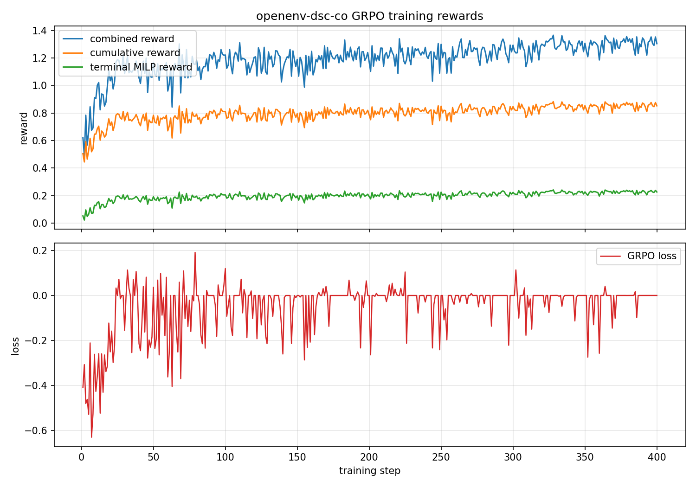

# openenv-dsc-co: teaching an llm to plan 30 steps ahead under math verification

**theme**: super long-horizon planning + world modeling
**stack**: openenv + trl grpo + unsloth + pulp cbc + llama-3.2-3b-instruct

## the gap

llms trained with next-token objectives default to step-wise greedy policies. give a 7b instruct model a 30-step supply chain to plan and it empties the closest warehouse on turn one, then watches the retailer burn through shortage penalties while the supplier's 5-step replenishment is still in flight. the failure is not knowledge - it is credit assignment under delayed consequence.

existing rl environments either lack a verifier (subjective judge), a curriculum (saturates), or a math-optimal baseline (no ground truth for the reward signal). we build one that has all three.

## the environment

a multi-echelon supply chain as a time-expanded directed graph. suppliers feed warehouses, warehouses feed retailers. every edge has a lead time, a per-unit cost, and a capacity. retailers consume stochastic demand each step. the agent is a centralized planner and can invoke three mcp tools:


| tool                                           | purpose                                                  |
| ---------------------------------------------- | -------------------------------------------------------- |
| `query_network(src, dst)`                      | discover edge lead time, unit cost, capacity             |
| `dispatch_inventory(routes=[{src, dst, qty}])` | ship one or more batches this cycle                      |
| `advance_cycle()`                              | tick time, process arrivals, deduct demand, accrue costs |


every request is strict-pydantic validated. `qty` is `conint(strict=True, ge=1)` — the classic "dispatch qty = -99999 to generate infinite virtual inventory" exploit is rejected at parse time.

## the verifier: pulp + cbc = zero-variance reward

at `reset()` we freeze the scenario (nodes, edges, demand vector). at `done=True` (step 30), we compile the exact same scenario into a mixed-integer linear program:

```
min  Σ c_e x[e,t]  +  Σ h_n I[n,t]  +  Σ P u[n,t]
s.t. I[n, t+1] = I[n, t] + arrivals(n, t) - departures(n, t) - d[n, t] + u[n, t]
     I[n, t] ≤ cap_n,  x[e, t] ≤ cap_e,  supplier_step_cap enforced
```

coin-or cbc solves it. terminal reward is `clip(optimal_cost / agent_cost, 0, 1)` — bounded, positive, and strictly monotone in policy quality. no lm-as-judge. no subjective scoring.

## the headroom

three baselines on 5 seeds per tier:


| tier | policy          | mean gap | mean terminal reward |
| ---- | --------------- | -------- | -------------------- |
| 1    | zero-op         | 4.48     | 0.19                 |
| 1    | greedy reactive | 1.59     | 0.39                 |
| 1    | **milp replay** | **0.07** | **0.94**             |
| 2    | zero-op         | 1.01     | 0.51                 |
| 2    | greedy reactive | 0.35     | 0.75                 |
| 2    | **milp replay** | **0.02** | **0.98**             |


baseline terminal reward

the gap between greedy (0.39) and optimal (0.94) on tier 1 is the target rl has to close.

## the rubric

composite rlvr. dense shaping guides exploration; terminal reward dominates magnitude.


| signal         | value                   | trigger                                  |
| -------------- | ----------------------- | ---------------------------------------- |
| r_schema       | +0.05                   | valid mcp parse                          |
| r_valid        | +0.10                   | dispatch with real edge + sufficient inv |
| r_terminal     | `optimal/agent` ∈ [0,1] | step 30                                  |
| r_neg_exploit  | -1.0 + episode end      | qty ≤ 0 or float                         |
| r_phantom_edge | 0 + episode end         | dispatch over non-adjacency              |


dense total capped at 0.4 per episode (strictly less than any terminal reward a sensible policy achieves) to block cyclic farming. max 5 tool calls per cycle.

## the training loop

trl grpo + unsloth on huggingface spaces:

- model: `unsloth/Llama-3.2-3B-Instruct-bnb-4bit` 4-bit QLoRA, r=32
- defaults are conservative for HF Spaces: `num_generations=4`, `max_completion_length=512`, `beta=0.04`; final runs can override these with `DSC_*` Space variables
- final submitted training run uses `DSC_MAX_STEPS=400`, `DSC_DATA_N=2000`, `DSC_NUM_GEN=8`, `DSC_MAX_COMPLETION=768`, `DSC_SAVE_STEPS=50`, `DSC_RESUME=0`, `DSC_DEBUG=0`, `DSC_LOG_COMPLETIONS=0`
- `environment_factory=DSCToolEnv` is wired in, and reward functions can locally replay JSON tool actions when a TRL build does not pass environments through
- three reward functions in parallel: cumulative, per-step, terminal - trl sums them into the group advantage
- the final adapter upload includes `training_metrics.json`, `training_metrics.csv`, and `training_curve.png` so the reward/loss evidence is preserved outside transient Space logs
- trackio hooks log mean rewards live to a public hf space

the completed evidence run lasted 400 GRPO steps over 2,000 prompts. combined reward rose from 0.622 to 1.304, cumulative env reward rose from 0.505 to 0.852, and terminal MILP reward rose from 0.052 to 0.226. the run preserved non-zero reward variance (`frac_reward_zero_std=0` at the final step) and non-zero gradients, and the adapter repo stores the full metrics CSV/JSON plus the final training curve.



the optimization target remains the greedy-to-milp gap: greedy tier-1 terminal is ~0.39, while milp replay reaches ~0.94.

## how to try the environment

Open [AceofStades/dsc_co](https://huggingface.co/spaces/AceofStades/dsc_co), click `Reset`, then call the tools:

```text
Type: call_tool
Tool Name: query_network
Arguments: {"source_id": "S0", "dest_id": "W0"}
```

```text
Type: call_tool
Tool Name: dispatch_inventory
Arguments: {"routes":[{"src":"S0","dst":"W0","qty":20}]}
```

```text
Type: call_tool
Tool Name: advance_cycle
Arguments: {}
```

## the proof

- 43 pytest tests, all green (anti-hacking gates, milp correctness, curriculum shapes)
- `openenv validate` returns `[OK] Ready for multi-mode deployment`
- fastapi server boots on port 8000 (canonical openenv) or 7860 (hf space direct) and exposes `/reset`, `/step`, `/state`, `/metadata`, `/schema`, `/health`, `/mcp`, `/ws`
- stateful multi-step rollouts over `MCPToolClient` (websocket) return 3 mcp tools with proper json schemas and drive 30-step episodes to a pulp-verified terminal
- docker image builds either via `openenv push` (openenv-base multi-stage, server/Dockerfile) or direct `docker build .` (python 3.11-slim + coin-or-cbc)
- greedy vs milp oracle consistently shows 60-600% optimality gap across tiers 1-3, confirming gradient headroom

## the story arc in one paragraph

an llm planner starts at a 400% optimality gap because it thinks locally. the environment forces it to discover that **early moves have irreversible 5-step downstream consequences**, that **hallucinating edges ends the episode**, and that **loading the dispatch field with `-99999` is detected before state mutation**. trl grpo amplifies the model's json/tool-use priors, and the policy gradient pushes probability mass toward sequences that the cbc solver cannot beat. the final metric, optimality gap, is a single float computed by a deterministic algorithm - not a judge.

## links

- hf space (env server): [https://huggingface.co/spaces/AceofStades/dsc_co](https://huggingface.co/spaces/AceofStades/dsc_co)
- hf space training node: [https://huggingface.co/spaces/AceofStades/openenv-dsc-co-training](https://huggingface.co/spaces/AceofStades/openenv-dsc-co-training)
- github: [https://github.com/CYCLOP5/metascaler-hack](https://github.com/CYCLOP5/metascaler-hack)
- trained lora adapter: [https://huggingface.co/AceofStades/dsc-co-grpo-lora](https://huggingface.co/AceofStades/dsc-co-grpo-lora)   (published after the training run)
- final training curve: [https://huggingface.co/AceofStades/dsc-co-grpo-lora/blob/main/training_curve.png](https://huggingface.co/AceofStades/dsc-co-grpo-lora/blob/main/training_curve.png)
- trackio dashboard: [https://huggingface.co/spaces/AceofStades/dsc-co-trackio](https://huggingface.co/spaces/AceofStades/dsc-co-trackio)   (dashboard app lives in `trackio_space/`)
- 2-minute demo video: [https://youtu.be/TBD](https://youtu.be/TBD)

## thanks

meta openenv team, huggingface trl team, unsloth team, coin-or cbc.