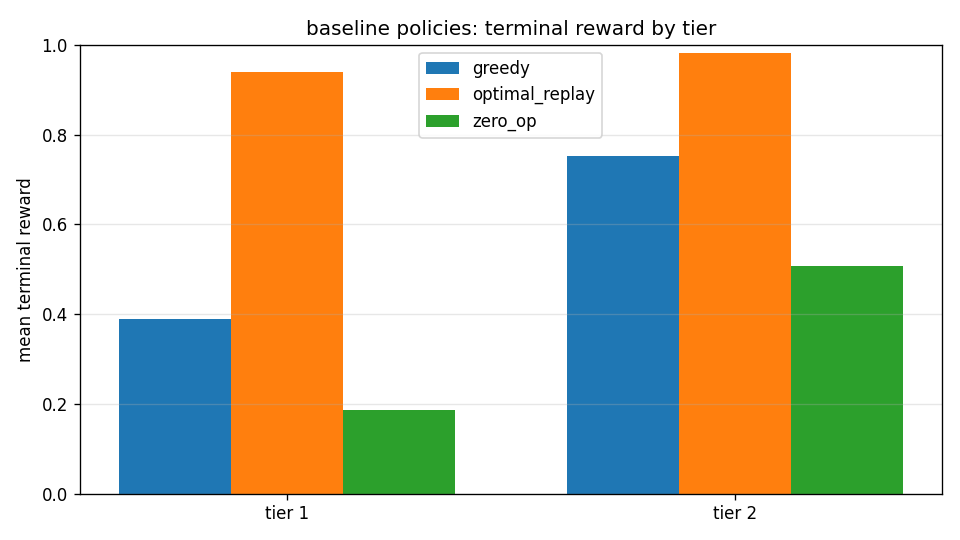
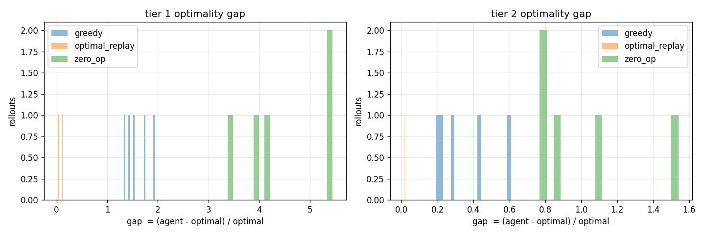

# openenv-dsc-co

dynamic supply chain combinatorial orchestration. a meta openenv-compliant rlvr/rlve environment. a 30-step multi-echelon supply chain graph verified by a deterministic pulp/cbc mixed-integer linear programming oracle. 100% api/json driven. single unprivileged docker container. hf space.

## links

| artifact | url |
|---|---|
| live hf space (env server) | https://huggingface.co/spaces/AceofStades/dsc_co |
| hf space (training node) | https://huggingface.co/spaces/AceofStades/openenv-dsc-co-training |
| github source | https://github.com/CYCLOP5/metascaler-hack |
| trained lora adapter | https://huggingface.co/AceofStades/dsc-co-grpo-lora (after training run) |
| final training curve | https://huggingface.co/AceofStades/dsc-co-grpo-lora/blob/main/training_curve.png (uploaded with adapter) |
| trackio live training dashboard | https://huggingface.co/spaces/AceofStades/dsc-co-trackio (auto-created on first run) |
| blog post | [BLOG.md](BLOG.md) |
| 2-minute demo script | [stufftodo/VIDEO.md](stufftodo/VIDEO.md) |

## docs index

start here, then jump into whichever judge track matters most:

| doc | what it shows |
|---|---|
| [BLOG.md](BLOG.md) | submission narrative: problem, verifier, training loop, proof |
| [stufftodo/VIDEO.md](stufftodo/VIDEO.md) | 2-minute demo script and asset checklist |
| [docs/architecture.md](docs/architecture.md) | runtime architecture, trainer/env/server data flow |
| [docs/reward-spec.md](docs/reward-spec.md) | reward components, dense cap, terminal verifier signal |
| [docs/milp-formulation.md](docs/milp-formulation.md) | exact min-cost-flow MILP solved by CBC |
| [docs/curriculum.md](docs/curriculum.md) | four procedural difficulty tiers and reproducibility |
| [docs/anti-hacking.md](docs/anti-hacking.md) | hard gates against reward/specification hacking |

## tl;dr

| aspect | value |
|---|---|
| action space | 3 mcp tools, strict pydantic v2 validation |
| observation | typed json, partial-observable via `query_network` |
| horizon | 30 discrete steps |
| reward | dense shaping (≤ 0.4) + terminal `clip(opt/agent, 0, 1)` |
| verifier | coin-or cbc milp, zero-variance signal |
| trainer | trl grpo + unsloth + llama-3.2-3b-instruct qlora |
| curriculum | 4 procedurally-generated tiers with ema gating |

## why this environment

llms default to step-wise greedy decisions. give a 7b instruct model a 30-step supply chain and early moves permanently truncate the viable solution space. this env measures and trains through that failure mode with a zero-variance, math-optimal reward.

| measurement | value |
|---|---|
| baseline greedy gap (tier 1, n=5) | **159%** |
| baseline zero-op gap (tier 1, n=5) | **448%** |
| milp-replay gap (tier 1, n=5) | **7%** |
| gradient headroom | ~0.55 terminal reward points |



## quick start

```
make install
make test
make eval N=10 TIERS="1 2"
make viz
make serve
```

then from a second shell:

```
python client.py reset --tier 1 --seed 7
python client.py query S0 W0
python client.py dispatch S0 W0 50
python client.py advance
python client.py tools
```

## hf space deployment

live hf space: https://huggingface.co/spaces/AceofStades/dsc_co

reproduce the deploy:

```
huggingface-cli login
openenv push -r AceofStades/dsc_co --exclude .openenvignore
```

`-r` (aka `--repo-id`) takes `username/env-name`. `--exclude .openenvignore` is **required** — the cli's default ignore is only `.*`, `__pycache__`, `*.pyc`, so your local `env/` venv would otherwise upload (~400 mb of compiled `.so` + cbc binaries = 500 error from hf).

optional flags: `--private`, `--base-image ghcr.io/meta-pytorch/openenv-base:latest`, `--hardware cpu-basic`, `--env-var KEY=VAL`, `--secret KEY=VAL`.

manual docker alternative:

```
docker build -t openenv-dsc-co .
docker run --rm -p 7860:7860 openenv-dsc-co
```

the hf space uses port 8000 by default (`openenv.yaml`). the root `Dockerfile` is wired for port 7860 if you deploy directly as a plain docker space.

## training on huggingface spaces

we use huggingface spaces as on-demand, high-vram gpu compute nodes for grpo training. 

workflow:
1. create a new space on huggingface (select **L4** or **A10G** 24GB gpu hardware, **Docker** sdk).
2. configure space secrets:
   - `HF_TOKEN` — a write-scope token from https://huggingface.co/settings/tokens
   - `DSC_HF_REPO` — `AceofStades/dsc-co-grpo-lora` (where the trained lora will be pushed)
3. push this codebase to the space:
   ```bash
   git remote add space https://huggingface.co/spaces/<your-user>/<your-space>
   git push space master:main
   ```
4. the space will build the `Dockerfile`, spin up a lightweight fastapi server (`app.py`) to satisfy the space's port 7860 health check, and kick off `train.py` in the background. check the space logs to watch unsloth run!

training stack:
- `unsloth/Llama-3.2-3B-Instruct-bnb-4bit` 4-bit qlora, r=32
- defaults: `num_generations=4`, `max_completion_length=512`, `beta=0.04`; override with `DSC_NUM_GEN`, `DSC_MAX_COMPLETION`, `DSC_BETA`
- final-run knobs: `DSC_MAX_STEPS`, `DSC_DATA_N`, `DSC_BATCH_SIZE`, `DSC_GRAD_ACCUM`, `DSC_LR`, `DSC_EPOCHS`, `DSC_TEMP`, `DSC_SAVE_STEPS`
- checkpoint recovery: set `DSC_RESUME=1` to resume the latest checkpoint in `DSC_OUT_DIR`
- vllm/fast inference is enabled only when the GPU supports it and `vllm` is installed; otherwise training falls back to the standard unsloth path
- when TRL does not pass environments into reward functions, `train.py` locally replays JSON tool actions through `DSCToolEnv` so rewards, loss, and gradients remain non-zero
- final model uploads include `training_metrics.json`, `training_metrics.csv`, and `training_curve.png` alongside the LoRA adapter
- `trackio.log({...})` streams metrics to the trackio dashboard.

final HF Space run preset:

```bash
DSC_MAX_STEPS=1000
DSC_DATA_N=2000
DSC_NUM_GEN=8
DSC_MAX_COMPLETION=512
DSC_SAVE_STEPS=100
DSC_RESUME=1
DSC_DEBUG=0
DSC_LOG_COMPLETIONS=0
```

reload the trained adapter anywhere with:

```python
from unsloth import FastLanguageModel
model, tok = FastLanguageModel.from_pretrained(
    "AceofStades/dsc-co-grpo-lora",
    max_seq_length=8192, load_in_4bit=True, fast_inference=True,
)
FastLanguageModel.for_inference(model)
```

## repo layout

canonical openenv multi-mode deployment layout:

```
openenv-dsc-co/
├── pyproject.toml            openenv-core[core] + pulp deps, pytest pythonpath
├── uv.lock                   pinned resolution for openenv-base docker builds
├── openenv.yaml              spec_version: 1, type: space, runtime: fastapi, app: server.app:app, port: 8000
├── __init__.py               package marker
├── models.py                 re-export shim for openenv push structural check
├── client.py                 MCPToolClient CLI (tools, loop, query, dispatch, probe, health)
├── README.md                 this file (hf space frontmatter at top)
├── BLOG.md                   hackathon submission post
├── stufftodo/VIDEO.md        2-minute demo script
├── Makefile                  install, serve, test, eval, viz, bench, docker, push-space, train
├── Dockerfile                python 3.11-slim + coinor-cbc + non-root, port 7860 (hf space direct)
├── requirements.txt          env-only pip deps (mac-safe)
├── requirements-train.txt    cuda training deps (torch, trl, unsloth)
├── server/
│   ├── __init__.py
│   ├── app.py                create_app(DSCEnv, CallToolAction, CallToolObservation) + fastapi fallback
│   ├── Dockerfile            openenv-base multi-stage build for `openenv push`
│   ├── dsc_environment.py    DSCEnv(MCPEnvironment) + 4-tier curriculum + 3 fastmcp tools
│   ├── models.py             pydantic v2 schemas (DSCAction RootModel, strict int qty)
│   ├── solver.py             pulp time-expanded min-cost flow + greedy baseline
│   └── policies.py           zero_op, greedy, optimal_replay baseline rollouts
├── tests/
│   ├── test_models.py        strict-int qty, action envelope parsing, observation schema
│   ├── test_env.py           reset shapes, anti-hack gates, valid flow, horizon termination
│   └── test_solver.py        milp correctness, tier shapes, bipartite edges
├── notebooks/
│   ├── train_hf_space.ipynb  end-to-end grpo run on hf spaces
│   └── demo.ipynb            before/after rollout plots
├── docs/
│   ├── architecture.md
│   ├── reward-spec.md
│   ├── milp-formulation.md
│   ├── curriculum.md
│   └── anti-hacking.md
├── assets/                   plots (gap_hist.png, terminal_bars.png, ...)
├── train.py                  trl grpo + unsloth + trackio + llama-3.2-3b
├── eval.py                   batch rollout harness -> eval.json
└── viz.py                    gap histograms, terminal bars, training curves
```

## mcp action space

> deep dive: [docs/architecture.md](docs/architecture.md)

| tool | args | semantics |
|---|---|---|
| `query_network` | `source_id: str, dest_id: str` | returns `{exists, lead_time, unit_cost, capacity}` |
| `dispatch_inventory` | `routes: [{src, dst, qty}]`, max 8 | strict int qty ≥ 1; deducts inv, schedules shipment |
| `advance_cycle` | none | ticks time, processes arrivals, deducts demand, accrues costs; finalize at step 30 |

max 5 calls per cycle; `advance_cycle` resets the per-cycle counter.

## observation

```
{
  "step": 0,
  "network_status": "nominal" | "disrupted",
  "nodes": [
    {"id", "type": "supplier" | "warehouse" | "retail",
     "inventory", "max_capacity", "holding_cost", "demand_forecast"}
  ],
  "pipeline": [{"src", "dst", "qty", "arrival_step"}],
  "reward": float, "done": bool,
  "metadata": {"tier", "agent_cost", "optimal_cost", "terminal", "calls_this_cycle"}
}
```

## reward rubric

> deep dive: [docs/reward-spec.md](docs/reward-spec.md)

| component | type | value | trigger | cap |
|---|---|---|---|---|
| r_schema | dense | +0.05 | valid pydantic-parsed tool call | sum dense ≤ 0.4 |
| r_valid | dense | +0.10 | dispatch with existing edge + inv sufficient | sum dense ≤ 0.4 |
| r_terminal | sparse | `clip(opt/agent, 0, 1)` | step == 30 | — |
| r_neg_exploit | terminal | −1.0 + done | qty ≤ 0 or float | — |
| r_phantom_edge | terminal | 0 + done | dispatch over edge not in adjacency | — |

## curriculum

> deep dive: [docs/curriculum.md](docs/curriculum.md)

| tier | suppliers | warehouses | retail | lead time | demand | disruptions |
|---|---|---|---|---|---|---|
| 1 | 1 | 1 | 1 | L=1 | static | none |
| 2 | 3 | 5 | 10 | L=1 | gaussian | none |
| 3 | 5 | 10 | 20 | L∈[1..5] | gaussian | capacity jitter |
| 4 | 7 | 14 | 28 | L∈[1..7] | seasonal | severe strikes |

## milp formulation

> deep dive: [docs/milp-formulation.md](docs/milp-formulation.md)

```
min   Σ_{e,t} c_e · x[e,t]
    + Σ_{n,t} h_n · I[n,t]
    + Σ_{n,t} P   · u[n,t]

s.t.  I[n, 0]    = I0_n
      I[n, t+1] = I[n, t] + arrivals(n, t) − departures(n, t) − d[n, t] + u[n, t]
      I[n, t]   ≤ cap_n
      x[e, t]   ≤ cap_e
      Σ_{e: src=s, t} x[e, t] ≤ sup_cap     (supplier)
      arrivals(n, t) = Σ_{e: dst=n, t−L_e ≥ 0} x[e, t − L_e]
```

solver: `pulp.PULP_CBC_CMD(msg=0, timeLimit=30)`.

## anti-hacking hard-gates

> deep dive: [docs/anti-hacking.md](docs/anti-hacking.md)

| vector | defense |
|---|---|
| negative / zero / float qty | pydantic `strict=True, ge=1` + pre-mutation `_is_underflow_qty` check → reward −1.0, done |
| cyclic reward farming | `MAX_CALLS_PER_CYCLE=5` + `DENSE_CAP=0.4`; holding cost > dense reward |
| phantom edge hallucination | immutable `_adjacency: frozenset` built at reset → dispatch off-graph ends episode |

## evaluation

```
make eval N=20 TIERS="1 2 3"
make viz
```

produces:
- `eval.json` with per-rollout cost, gap, terminal
- `assets/gap_hist.png` per-tier gap histograms
- `assets/terminal_bars.png` mean terminal reward bars by policy × tier



caption: non-trained baseline policies leave large optimality gaps; `optimal_replay` is the MILP-derived upper-bound behavior.


caption: terminal reward has clear headroom for RL; greedy behavior is far below the MILP replay ceiling on tier 1.

baseline numbers on 5 seeds (tier 1 / tier 2):

| policy | tier 1 gap / terminal | tier 2 gap / terminal |
|---|---|---|
| zero_op | 4.48 / 0.19 | 1.01 / 0.51 |
| greedy | 1.59 / 0.39 | 0.35 / 0.75 |
| optimal_replay | **0.07 / 0.94** | **0.02 / 0.98** |

greedy ↔ optimal_replay gap is the rl learning target (~0.55 terminal reward points on tier 1).

## tests

```
make test
```

43 tests across models, env, solver:
- strict-int qty rejection (5 cases)
- action envelope parsing (3 tool kinds + rejection)
- tier 1/2 shape invariants + determinism
- all 3 anti-hack gates under step()
- horizon termination with milp finalize
- milp correctness: `optimal_cost ≤ greedy_cost` on random tier-1 scenarios
- bipartite edge topology

## judging criteria alignment

| criterion | weight | evidence |
|---|---|---|
| environment innovation | 40% | time-expanded graph with milp oracle; 3 hard-gated exploitation vectors; 4-tier procedural curriculum with ema gating |
| storytelling | 30% | `BLOG.md` + `stufftodo/VIDEO.md` with explicit before/after arc and numbers |
| showing improvement | 20% | `make eval` + `make viz` produces gap histograms; trackio live dashboard hook; near-optimal replay baseline provides ground-truth upper bound |
| reward and training pipeline | 10% | 43 green tests; composite rubric + anti-hack gates; `train.py` with 3 reward functions + trackio + strict grpo config |

## credits

meta pytorch openenv team. huggingface trl team. unsloth team. coin-or cbc. apache-2.0.
